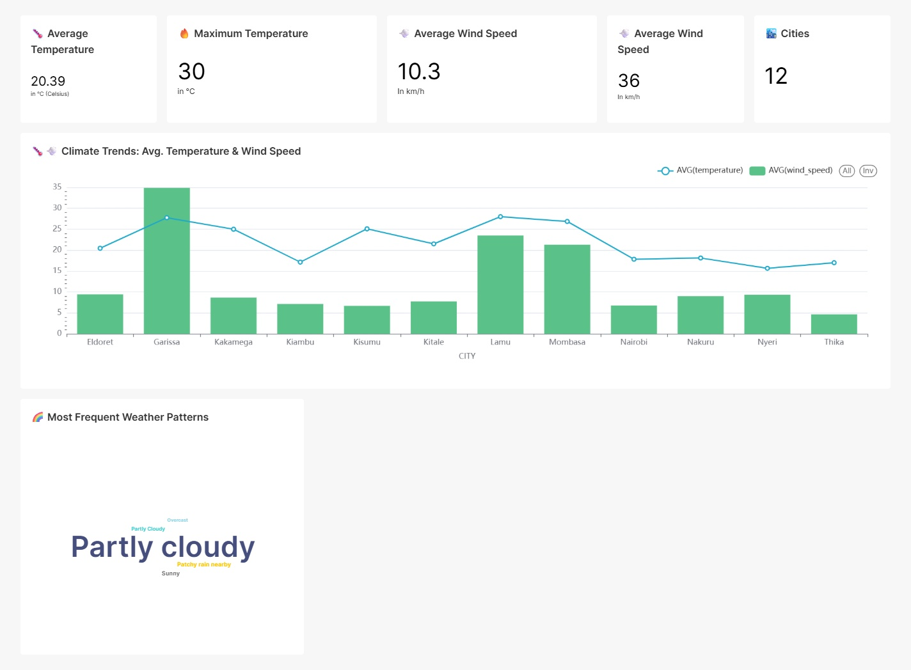

# Weather Data Engineering ETL Pipeline 🌤️

A comprehensive end-to-end data engineering solution that collects, processes, and visualizes weather data for major Kenyan cities using modern data stack technologies.

## 🚀 Project Overview

As a data engineer, I built this pipeline to demonstrate real-world ETL capabilities using industry-standard tools. The system automatically fetches weather data from WeatherStack API, transforms it through dbt models, and presents insights via interactive Superset dashboards.

### 🎯 Business Value
- **Automated Weather Intelligence**: Real-time weather monitoring for Kenyan cities
- **Scalable Architecture**: Container-based deployment ready for production
- **Data-Driven Insights**: Historical trends and daily weather analytics
- **Modern Stack**: Industry-standard tools (Airflow, dbt, Superset, Docker)

## 🏗️ Architecture & Data Flow

```
WeatherStack API → Airflow (Orchestration) → PostgreSQL → dbt (Transform) → Superset (BI)
```

### Data Pipeline Components:
1. **Data Ingestion**: Airflow DAGs fetch weather data from WeatherStack API
2. **Data Storage**: Raw data stored in PostgreSQL with proper schema design
3. **Data Transformation**: dbt models create staging and mart layers
4. **Data Visualization**: Superset dashboards for weather analytics
5. **Orchestration**: Automated scheduling and monitoring via Airflow

## 🛠️ Technology Stack

| Component | Technology | Purpose |
|-----------|------------|---------|
| **Orchestration** | Apache Airflow 3.0.5 | Workflow management and scheduling |
| **Data Transformation** | dbt (Data Build Tool) | SQL-based transformations |
| **Database** | PostgreSQL 14.19 | Data storage and processing |
| **Business Intelligence** | Apache Superset | Dashboards and visualizations |
| **Database Management** | pgAdmin | Database administration |
| **Containerization** | Docker Compose | Environment isolation |
| **API Source** | WeatherStack API | Real-time weather data |

## 📁 Project Structure

```
weather-data-engineering-etl-pipeline/
├── airflow/
│   └── dags/                    # Airflow DAG files
│       ├── dbt_orchastrator.py  # Main orchestration DAG
│       ├── orchestrator.py      # Data ingestion DAG  
│       ├── weather_helpers.py   # Helper functions
│       └── transformations.py   # Data transformation utilities
├── api_request/                 # API integration modules
│   ├── api_request.py          # WeatherStack API client
│   └── insert_records.py      # Database insertion logic
├── dbt/                        # dbt project structure
│   ├── profiles.yml           # dbt connection profiles
│   └── my_project/            # dbt models and configurations
│       ├── models/
│       │   ├── staging/       # Raw data staging models
│       │   ├── mart/          # Business logic models
│       │   └── sources/       # Source table definitions
│       └── dbt_project.yml    # dbt project configuration
├── docker/                     # Docker configuration files
├── postgres/                   # PostgreSQL initialization
│   ├── airflow_init.sql       # Airflow database setup
│   └── superset_init.sql      # Superset database setup
├── docker-compose.yaml         # Main Docker Compose file
├── docker-compose-simple.yaml  # Minimal setup (backup)
├── .env.example               # Environment variables template
├── .gitignore                # Git ignore rules
├── PRODUCTION_SECURITY.md     # Security guidelines
└── README.md                  # This documentation
```

## 🚀 Quick Start Guide

### Prerequisites

- Docker and Docker Compose
- Git

### Setup Steps

1. **Clone the repository:**
   ```bash
   git clone https://github.com/Jayson-gor/weather-data-engineering-etl-pipeline.git
   cd weather-data-engineering-etl-pipeline
   ```

2. Create a `.env` file from the example:
   ```bash
   cp .env.example .env
   ```
   
   Then edit `.env` and replace all placeholder values with secure credentials:
   - Generate strong passwords (min 16 characters)
   - Use a real email address for pgAdmin
   - Get your actual WeatherStack API key
   - Generate secure secret keys (32+ characters)

3. **Start the services:**
   ```bash
   docker-compose up -d
   ```

4. **Access the applications:**
   - **Airflow UI**: http://localhost:8000 (admin/admin)
   
   - **Superset BI**: http://localhost:8088 (admin/admin)
   
   - **pgAdmin**: http://localhost:5050 (credentials from .env)
   

5. **Trigger the pipeline:**
   - Navigate to Airflow UI
   - Enable and trigger the `weather_api_orchestrator` DAG
   - Monitor the pipeline execution and data flow

## 💡 My Journey as a Data Engineer

### 🎯 Project Motivation
I built this pipeline to solve a real-world problem: providing reliable weather insights for Kenyan cities. As a data engineer, I wanted to demonstrate end-to-end pipeline development using modern tools that are industry-standard in 2024.

### 🔧 Technical Challenges I Overcame

#### 1. **Container Orchestration Complexity**
**Challenge**: Initially struggled with Docker networking and service dependencies.
**Solution**: Implemented proper Docker Compose networking with health checks and dependency management. Learned the importance of container startup order and resource allocation.

#### 2. **Airflow-dbt Integration**
**Challenge**: Getting Airflow to properly execute dbt commands within containers was tricky.
**Solution**: Mounted Docker socket to Airflow container and configured dbt profiles for cross-container communication. This taught me about container security implications.

#### 3. **Database Connection Management**
**Challenge**: Multiple services (Airflow, dbt, Superset) needed different database access patterns.
**Solution**: Created separate database users with appropriate permissions and implemented connection pooling. This highlighted the importance of database security and resource management.

#### 4. **Environment Configuration**
**Challenge**: Managing secrets and environment variables across multiple services securely.
**Solution**: Implemented .env file pattern with proper gitignore rules and created comprehensive security documentation. Learned about secrets management best practices.

#### 5. **Data Quality & Schema Evolution**
**Challenge**: Ensuring data consistency and handling API response variations.
**Solution**: Implemented dbt data tests and schema validation. Added error handling and data quality checks in the ingestion layer.

### 📊 Data Engineering Best Practices Implemented

1. **Separation of Concerns**: Clear distinction between ingestion, transformation, and presentation layers
2. **Infrastructure as Code**: Everything containerized and version-controlled
3. **Data Lineage**: Clear data flow from source to dashboard with dbt documentation
4. **Error Handling**: Comprehensive error handling and retry logic in DAGs
5. **Security**: Proper secrets management and environment isolation
6. **Monitoring**: Built-in Airflow monitoring and alerting capabilities
7. **Documentation**: Comprehensive documentation for maintainability

### 🎓 Key Learnings

- **Modern Data Stack**: Hands-on experience with industry-standard tools
- **Container Orchestration**: Deep understanding of Docker networking and service management
- **Workflow Orchestration**: Complex DAG design and dependency management
- **Data Modeling**: Dimensional modeling principles with dbt
- **Production Readiness**: Security, monitoring, and deployment considerations

## 🔍 Pipeline Deep Dive

### Data Ingestion Layer
- **Source**: WeatherStack API providing real-time weather data
- **Frequency**: Scheduled hourly data collection
- **Error Handling**: Retry logic and dead letter queues for failed requests
- **Data Validation**: Schema validation and data quality checks

### Transformation Layer  
- **Tool**: dbt for SQL-based transformations
- **Structure**: Staging → Mart layer architecture
- **Models**: 
  - `staging.sql`: Raw data cleaning and standardization
  - `daily_average.sql`: Daily weather aggregations
  - `weather_report.sql`: Final business metrics
- **Testing**: Built-in dbt tests for data quality assurance

### Presentation Layer
- **Tool**: Apache Superset for interactive dashboards
- **Features**: Real-time weather monitoring and historical trend analysis
- **Visualizations**: Time series charts, geographical maps, and KPI cards

## 🔧 Development Setup

### Prerequisites
- Docker and Docker Compose
- Git
- WeatherStack API key (free tier available)

### Local Development
```bash
# Start services in development mode
docker-compose up --build

# View logs
docker-compose logs -f airflow

# Execute dbt commands manually
docker exec dbt_container dbt run --project-dir /root/dbt/my_project

# Access database directly
docker exec -it postgres_container psql -U user -d weather_data
```

## 🚀 Production Deployment

### Current Status: Development Ready ✅
This pipeline is fully functional for development and testing environments.

### Production Deployment Checklist
**See [PRODUCTION_SECURITY.md](./PRODUCTION_SECURITY.md) for detailed production deployment guidelines.**

#### Security Requirements
- [ ] Replace all default passwords with strong credentials
- [ ] Set up proper SSL/TLS certificates  
- [ ] Configure firewall rules (only allow necessary ports)
- [ ] Use secrets management (HashiCorp Vault, AWS Secrets Manager)
- [ ] Set up monitoring and alerting
- [ ] Configure backup strategy
- [ ] Enable audit logging

#### Production Environment
- [ ] Use production-grade database (managed PostgreSQL)
- [ ] Set up load balancers
- [ ] Configure auto-scaling
- [ ] Set up CI/CD pipelines
- [ ] Use container orchestration (Kubernetes)
- [ ] Implement disaster recovery
- [ ] Set up monitoring (Prometheus, Grafana)

## 🤝 Contributing

I welcome contributions! Please feel free to:
- Report bugs or issues
- Suggest new features or improvements
- Submit pull requests
- Share your own implementations

### Development Guidelines
1. Follow the existing code structure
2. Add tests for new features
3. Update documentation
4. Use meaningful commit messages

## 📞 Connect With Me

- **GitHub**: [@Jayson-gor](https://github.com/Jayson-gor)
- **Email**: gorjayson4@gmail.com
- **LinkedIn**: [Connect with me](https://linkedin.com/in/jayson-gor)

## 📝 License

This project is open source and available under the MIT License.

## 🙏 Acknowledgments

- WeatherStack for providing free weather API
- The open-source community for the amazing tools
- Docker and container ecosystem
- Apache Software Foundation (Airflow, Superset)
- dbt Labs for the transformation framework

---

⭐ **If this project helped you, please give it a star!** ⭐

*Built with ❤️ by a passionate data engineer*

